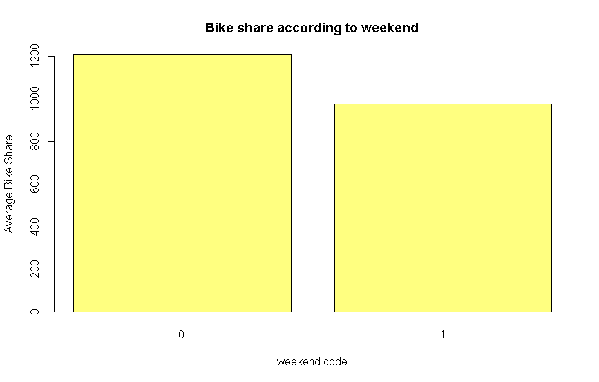
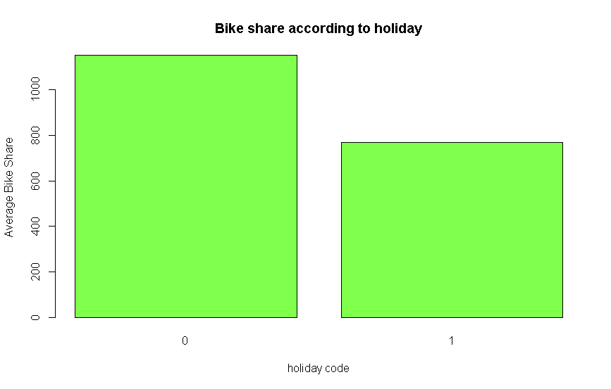
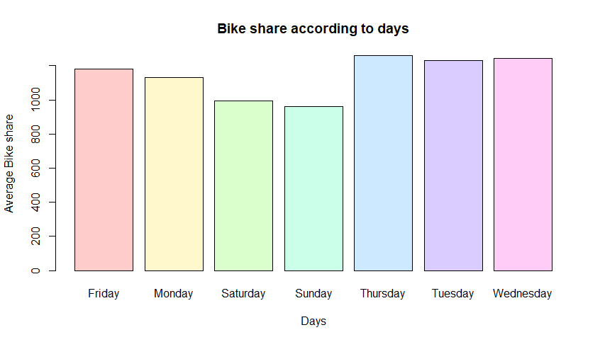
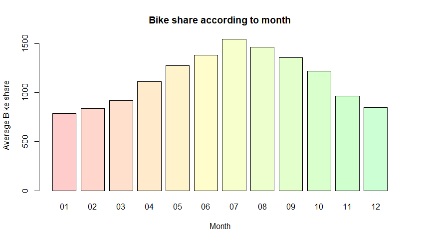
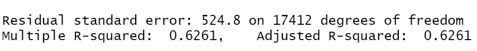
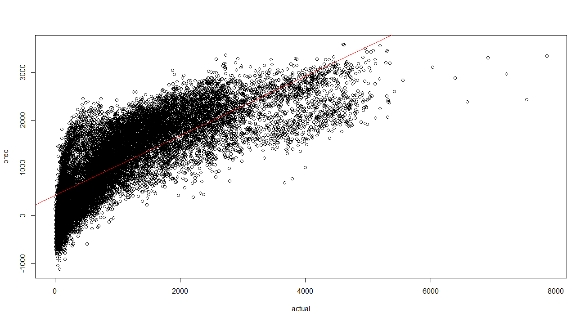

# ROK-LondonBikeShare

Prediksi pengguna Bike Share

Dalam laporan ini, akan dibahas data London Bike Share mulai dari analisa data, penggunaan model untuk melakukan prediction, dan membuat tampilan pada RShiny. Dalam melakukan analisa dan prediksi akan ada beberapa pertanyaan yang akan dibahas dan dicari. Beberapa hal yang akan dicoba untuk dicari adalah sebagai berikut:
1. Variabel yang memiliki hubungan (pengaruh) dengan jumlah Bike Share
2. Model machine learning yang dapat digunakan untuk melakukan prediksi beserta evaluasi
3. Prediksi penggunaan Bike Share ± 1 tahun kedepan berdasarkan penggunaan di 2 tahun awal
4. Prediksi penggunaan Bike Share berdasarkan variabel yang memiliki pengaruh (nomor 1)

## Exploratory Data Analysis

Pada bagian ini akan dibuat analisa dari data London Bike Share, hubungan tiap variabel dan pengaruhnya pada jumlah sewa sepeda. Berikut adalah info mengenai data yang akan digunakan. 

```
"timestamp" - timestamp field for grouping the data
"cnt" - the count of a new bike shares
"t1" - real temperature in C
"t2" - temperature in C "feels like"
"hum" - humidity in percentage
"windspeed" - wind speed in km/h
"weathercode" - category of the weather
"isholiday" - boolean field - 1 holiday / 0 non holiday
"isweekend" - boolean field - 1 if the day is weekend
"season" - category field meteorological seasons: 0-spring ; 1-summer; 2-fall; 3-winter.

"weather_code" category description:
1 = Clear ; mostly clear but have some values with haze/fog/patches of fog/ fog in vicinity 
2 = scattered clouds / few clouds 
3 = Broken clouds 
4 = Cloudy 
7 = Rain/ light Rain shower/ Light rain 
10 = rain with thunderstorm 
26 = snowfall 
94 = Freezing Fog
```

Setelah mengenal data, akan dilanjutkan dengan descriptive statistics atau ringkasan sederhana dari data tersebut. Hal ini dapat dilakukan dengan menggunakan kode **summary(namaData)** yang menampilkan mean, median, standard deviation, dan lain-lain. Ada juga **str(namaData)** yang dapat menampilkan struktur dari data termasuk semua nama variabel, tipe datanya, dan bagian depan dari data pada tiap variabel. Hasil dari kode tersebut adalah sebagai berikut:

   

Persiapan data, info data dan kode untuk bagian korelasi dapat dilihat lebih jelas di file [dataCorrelation.R](dataCorrelation.R)

### Data Dependency - Correlation


Pada gambar diatas, dibuat sebuah scatterplot matrix untuk melihat korelasi antar data. Setiap hubungan/pair antar variabel memiliki hubungannya tersendiri. Seperti contoh antara t1 dan t2, kelihatan sebuah garis naik yang hampir lurus. Ini adalah contoh dari hubungan variabel yang memiliki positive correlation.


Perhitungan correlation coefficient dapat dilihat dengan lebih jelas pada tabel di atas. Angka dalam korelasi tersebut menentukan dependency antar variabel. Perhitungan correlation coefficient yang digunakan adalah milik Pearson. Angka positif biasanya menunjukkan positive correlation yang berarti nilai satu variabel akan naik jika yang pasangannya juga naik. Sedangkan angka negatif biasanya menunjukkan negative correlation di mana suatu nilai akan naik jika variabel pasangannya menurun. Kuatnya dependency antar variabel bergantung pada angkanya di mana 1 dan -1 menunjukkan korelasi positif dan negatif yang sempurna, dan 0 menunjukkan tidak adanya korelasi sama sekali. Arti tiap angka dapat dilihat dengan lebih jelas pada tabel berikut:

**tabel**

Visualisasi dari correlation table di atas juga dapat dilihat di correlation matrix di bawah ini.


Dari tampilan mengenai korelasi antar variabel yang telah disampaikan sebelumnya, terdapat beberapa hal yang ditemukan.
- t1 dan t2 (suhu asli dan yang dirasakan) dengan cnt (jumlah bike share) memiliki positive correlation, yang berarti terdapat kecenderungan meningkatnya jumlah bike share dengan meningkatnya suhu di area tersebut.
- Sebaliknya, hum (persentase kelembapan) dengan cnt (jumlah bike share) memiliki negative correlation, yang berarti terdapat kecenderungan meningkatnya jumlah bike share dengan menurunnya persentase kelembapan pada saat itu.
- Variabel yang lain tidak memiliki hubungan yang kuat dengan cnt (jumlah bike share) oleh karena nilai correlation coefficient hanya berkisar antara 0.1. Jika dilihat pada tabel diatas, berarti tidak relevan atau tidak terdapat hubungan yang cukup jelas. Hal ini terjadi karena variabel weather_code, is_holiday, is_weekend, dan season adalah data kategorikal yang memiliki arti untuk tiap angka yang terdapat dalam data. Hubungan dengan data kategorikal akan di analisa kembali di bagian selanjutnya.

### Bike Share Comparison

Pada bagian ini akan dianalisa lebih lanjut hubungan antara variabel yang ada dengan jumlah bike share. Hal ini akan dilakukan dengan membuat bar plot yang membandingkan rata-rata jumlah bike share berdasarkan faktor yang ada. Empat variabel pertama yang akan dianalisa adalah season, is_weekend, is_holiday, dan weather_code yang bersifat kategorikal.

  
  

Setelah data dibuat dalam bentuk barplot dan dianalisa, terdapat hal-hal yang membuat peminjaman sepeda meningkat ataupun menurun. Jika dilihat dari peminjaman sepeda pada musim yang berbeda, terdapat perbedaan rata-rata dalam jumlah peminjaman sepeda. Dari barplot bisa diambil bahwa rata-rata paling banyak saat musim 1 (summer) dan kebalikannya, yang paling sedikit saat musim 3 (winter). Selain itu, peminjaman sepeda juga terdampak dari apakah sedang weekend atau tidak, dimana 0 (not weekend)  mengalami rata-rata jumlah peminjamaan yang lebih banyak. Barplot juga menjelaskan bahwa rata-rata jumlah peminjaman sepeda pada hari libur lebih banyak dibandingkan saat hari biasa. Dan terakhir adalah peminjaman sepeda menurut cuaca. Yang bisa kami ambil adalah nomor 2 (cattered clouds / few clouds) memiliki rata-rata peminjaman sepeda yang paling banyak dibandingkan yang lan terutama saat cuaca 26 (snowfall). 

Selanjutnya analisa akan dilanjutkan dengan variabel t1, t2, hum, dan wind_speed. Hubungan antara variabel ini dengan jumlah bike share sempat dilihat pada bagian **Data Dependency**. Kita akan lihat dengan lebih dekat apakah terdapat hubungan antar variabel tersebut dengan jumlah bike share.

  
 

Jadi bisa dilihat dari lineplot yang sudah dibuat, rata-rata bike share mengalami kenaikan  disaat t1 atau real temperature mengalami kenaikan juga meskipun terdapat kenaikan dan penurunan saat t1 berada 25 sampai 33. Hubungan rata-rata peminjaman sepeda dengan real temperature mengalami puncaknya saat di t1/real temperature berada di 35 dengan jumlah rata-rata peminjaman sepeda lebih dari 4000.
Sama juga dengan halnya hubungan rata-rata bike share dengan t2(temperature feels like), dimana rata-rata peminjaman sepeda mengalami kenaikan bersamaan saat t2 mengalami kenaikan juga tetapi terjadi juga kenaikan disaat t2 berada di -5.
Selanjutnya di line plot yang ketiga, bisa dilihat bahwa cnt atau rata-rata peminjaman sepeda mengalami penurunan saat humidity mengalami kenaikan. 
Line plot yang terakhir memiliki hubungan antara cnt dengan wind speed. Tidak seperti line plot sebelumnya, line plot ini mengalami beberapa kenaikan dan penurunan yang drastic. Misalnya disaat windspeed 10, 14, 25, 38, dan 42,memiliki jumlah cnt yang tinggi tetapi saat di 11, 15, 31, 50, dan 52, terjadi penurunan dalam jumlah cnt.

Selanjutnya akan dianalisa dengan variabel waktu yang diberikan. Data ini merupakan sebuah data time series, data yang memiliki time stamp atau diurutkan berdasarkan waktu. Pada bagian Correlation, belum sempat dibahas apakah ada hubungan antara jumlah Bike Share dan waktu. Disini akan dilakukan analisa dengan membandingkan rata-rata bike share dengan tanggal, hari, bulan, tahun, dan jam. 

  
 

Pada grafik pertama, "Bike share according to date", tidak ada banyak korelasi atau hubungan yang dapat dilihat dengan rata-rata jumlah bike share. Hal ini kemungkinan terjadi karena tanggal dalam sebuah bulan tidak terlalu menentukan apakah seseorang akan menggunakan sepeda. Misalnya tanggal 2 bisa jatuh pada hari kerja atau hari libur. Oleh karena itu, akan dilanjutkan dengan perbandingan jumlah bike share dengan hari (Senin, Selasa, dan seterusnya). Pada grafik "Bike share according to days", dapat dilihat bahwa terdapat sedikit penurunan rata-rata jumlah bike share pada hari Sabtu dan Minggu. Sesuai dengan bar plot "Bike share according to weekend" yang telah dijelaskan sebelumnya, memang terdapat penggunaan yang lebih tinggi pada hari kerja. 
Selanjutnya adalah perbandingan penggunaan bike share dengan bulan. Dalam grafik ini dapat dilihat bahwa terdapat sedikit kenaikan pada bulan 6 (Juni) - 9 (September). Jika kita lihat lebih lanjut, bulan ini adalah musim panas (Summer) dan bisa di lihat kembali pada grafik "Bike share according to season" bahwa musim dengan penggunaan tertinggi adalah dengan kode 1 (Summer). Perbandingan dilanjutkan dengan variabel tahun. Data bike share yang digunakan terdiri atas 3 tahun (2015-2017) namun sebenarnya data ini secara keseluruhan hanya berjumlah 2 tahun. Hal ini karena data dimulai dari 4 Januari 2015 - 4 Januari 2017. Jika dilihat dari grafik diatas, tidak terdapat perbedaan yang signifikan antara tahun 2015 dan 2016. Sedangkan untuk tahun 2017 memiliki penurunan yang jauh disebabkan oleh datanya yang hanya mengandung 4 hari penggunaan pada tahun tersebut.


Terakhir adalah perbandingan penggunaan bike share dengan jam di hari tersebut. Ini menjadi salah satu variabel yang dipertimbangkan karena salah satu asumsi yang dipikirkan adalah bahwa bike share digunakan oleh orang yang bekerja. Dapat dilihat pada grafik diatas, penggunaan bike share paling tinggi berada pada jam 8 pagi dan jam 5-6 sore. Perlu diingat bahwa jam tersebut adalah sekitaran jam berangkat kerja dan jam pulang kerja. Oleh karena itu terdapat peningkatan pengunaan bike share yang cukup signifikan pada periode tersebut. Begitu pula dengan penggunaan bike share yang sangat rendah pada jam 12 malam sampai jam 5 pagi. Hal ini kemungkinan besar terjadi karena jam tersebut adalah jam tidur untuk kebanyakan orang.

Kesimpulan Analisa:
- X
- Y

## Machine Learning & Prediction

### Prophet
Prophet adalah prosedur untuk meramalkan data deret waktu (time series) berdasarkan model aditif dimana tren non-linier sesuai dengan musim tahunan, mingguan, dan harian, dan efek liburan. Model ini berfungsi paling baik dengan deret waktu yang memiliki efek musiman yang kuat dan data historis beberapa musim. Jadi bisa disimpulkan prophet itu melihat data yang ada pada sebelum-nya sehingga kita dapat melihat dan menganalisa untuk kedepannya.
Prophet menggunakan model deret waktu yang dapat diuraikan dengan 3 komponen model utama, yaitu: tren, musim, dan hari libur, yang dapat dituliskan melalui persamaan berikut:

y(t) = g(t) + s(t) + h(t) +εt

g(t): perubahan non-periodik dalam nilai deret waktu

s(t): perubahan periodik (contohnya musiman, mingguan, tahunan)

h(t): efek liburan yang terjadi pada jadwal, yang berpotensi membuat ketidakteraturan 

εt    : perubahan yang tidak biasa yang tidak diakomodasi oleh model
	
- Tren
 
 Kita dapat melihat dari kurva linier, pemerhatian dari dalam kurva linier ini dapat memastikan sesuatu hal paling terpengaruh atau tidak terpengaruh oleh lonjakan data. Contohnya jika kita bicara mengenai tren, ada beberapa titik dimana suatu perubahan akan terjadi secara drastis atau dengan kata lain terjadinya lonjakan perubahan. Ini yang menyebabkan terjadinya lonjakan data pada kurva linier tadi.
- Musim

Dalam hal ini musim juga berpengaruh pada kegiatan manusia, kita bisa melihat ada empat musim yang berbeda, dan dari keempat musim ini masing-masing musim memiliki pengaruhnya sendiri-sendiri pada kegiatan manusia. Selain itu mengenai musim kita juga bisa melihat musim yang terjadi berdasarkan tahunan, mingguan, harian. Itu semua bisa kita lihat dengan menggunakan prophet.
- Hari libur

Hari libur dan event dapat menimbulkan suatu keramaian dan lonjakan dalam suatu rangkaian waktu, ini dikarenakan pada hari libur orang-orang pergi berbelanja dan membeli banyak barang selama periode tersebut. Dengan prophet kita dapat mengubah dan memprediksi pasar mengikuti tema hari libur atau event tersebut, kita juga dapat membandingkan dengan tahun yang sebelumnya ada, kita bisa menggunakan tema yang lagi trend pada musim yang akan datang untuk membuat suasana acara dan efek liburan yang berbeda setiap tahun. Dengan kata lain kita juga bisa melihat dan menganalisa tahun kedepannya.

Manfaat penting dari model yang dapat didekomposisi adalah memungkinkan kita untuk melihat setiap komponen prediksi secara terpisah. Komponen-komponen tersebut antara lain adalah tren, musim mingguan, dan musim tahunan. Hal tersebut sangat berguna bagi para analis untuk mendapatkan wawasan tentang masalah peramalannya, selain hanya menghasilkan prediksi. 

#### Evaluation
Model prediksi yang digunakan adalah prophet, serta menggunakan regressor temperature dan humidity. Kami membuat prediksi selama 90 hari ke depan untuk tiap jamnya (atau selama 2160 jam). Sebelum menambahkan regressor, nilai multiple R-squared sebesar 0.591, dan setelah menambahkan regressor, nilai multiple R-squared sebesar 0.6261. 
R squared adalah bilangan yang berkisar antara 0 sampai 1 yang mengindikasikan besarnya kombinasi variabel independen secara bersama – sama mempengaruhi nilai variabel dependen. Semakin besar bilangan R squared (mendekati angka satu), model yang dikeluarkan akan semakin baik.


#### Result

  Dari gambar di atas, dapat dilihat bahwa titik-titik hitam adalah poin data aktual, dan garis biru adalah nilai prediksi. Prediksi untuk 90 hari selanjutnya ada di bagian akhir garis biru (setelah 2017-01). 
  

  Grafik di atas merupakan komponen dari model time series ini. Dari gambar di atas, kita dapat melihat tren yang secara keseluruhan mengalami kenaikan. Grafik weekly menunjukkan jumlah rental sepeda setiap harinya dalam 1 minggu.  Pada grafik tersebut, dapat ditarik kesimpulan bahwa jumlah rental sepeda pada hari Kamis dan Jumat relatif lebih tinggi dibandingkan hari lainnya, sedangkan jumlah rental sepeda pada hari Minggu paling rendah. Grafik yearly menunjukkan jumlah rental sepeda pada tiap musim sepanjang tahun. Dapat dilihat bahwa jumlah rental sepeda pada bulan Januari (musim dingin) lebih rendah dibandingkan musim lainnya, dan jumlah rental sepeda sekitar bulan Juli (musim panas) tinggi. Grafik daily menunjukkan jumlah rental sepeda pada tiap jam selama 1 hari. Berdasarkan grafik, jumlah rental sepeda pada jam 8 dan 18 relatif lebih tinggi dibandingkan jam lainnya. Grafik terakhir adalah grafik dari ekstra regressor yang digabungkan menjadi 1 (humidity dan temperature). 


  Grafik di atas menggambarkan kinerja atau performansi dari model yang telah dibuat, dengan scatter plot antara nilai prediksi dan nilai aktual. Nilai multiple R-squared dari model ini adalah 0.6261. 


## RShiny
...

#### Kontribusi


#### Group 4 London Bike Share 
- Michelle Callista
- Muhammad Marzuqi Laksamana
- Patrick Widyanto Oetomo
- Peter Iskandar
- Priscilla Agustin 

#### Other
[Link to London Bike Share Dataset](https://www.kaggle.com/hmavrodiev/london-bike-sharing-dataset)
[Reference for Prophet Model]
[Link to Prophet Reference](https://peerj.com/preprints/3190/)
