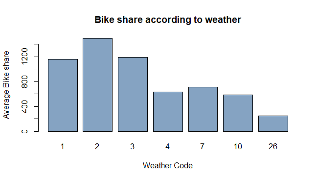

# ROK-LondonBikeShare

Prediksi pengguna Bike Share

## Exploratory Data Analysis

Pada bagian ini akan dibuat analisa dari data London Bike Share, hubungan tiap variabel dan pengaruhnya pada jumlah sewa sepeda. Berikut adalah info mengenai data yang akan digunakan. 

```
"timestamp" - timestamp field for grouping the data
"cnt" - the count of a new bike shares
"t1" - real temperature in C
"t2" - temperature in C "feels like"
"hum" - humidity in percentage
"windspeed" - wind speed in km/h
"weathercode" - category of the weather
"isholiday" - boolean field - 1 holiday / 0 non holiday
"isweekend" - boolean field - 1 if the day is weekend
"season" - category field meteorological seasons: 0-spring ; 1-summer; 2-fall; 3-winter.

"weather_code" category description:
1 = Clear ; mostly clear but have some values with haze/fog/patches of fog/ fog in vicinity 
2 = scattered clouds / few clouds 
3 = Broken clouds 
4 = Cloudy 
7 = Rain/ light Rain shower/ Light rain 
10 = rain with thunderstorm 
26 = snowfall 
94 = Freezing Fog
```

Setelah mengenal data, akan dilanjutkan dengan descriptive statistics atau ringkasan sederhana dari data tersebut. Hal ini dapat dilakukan dengan menggunakan kode **summary(namaData)** yang menampilkan mean, median, standard deviation, dan lain-lain. Ada juga **str(namaData)** yang dapat menampilkan struktur dari data termasuk semua nama variabel, tipe datanya, dan bagian depan dari data pada tiap variabel. Hasil dari kode tersebut adalah sebagai berikut:

   

Persiapan data, info data dan kode untuk bagian korelasi dapat dilihat lebih jelas di file [dataCorrelation.R](dataCorrelation.R)

### Data Dependency - Correlation


Pada gambar diatas, dibuat sebuah scatterplot matrix untuk melihat korelasi antar data. Setiap hubungan/pair antar variabel memiliki hubungannya tersendiri. Seperti contoh antara t1 dan t2, kelihatan sebuah garis naik yang hampir lurus. Ini adalah contoh dari hubungan variabel yang memiliki positive correlation.


Perhitungan correlation coefficient dapat dilihat dengan lebih jelas pada tabel di atas. Angka dalam korelasi tersebut menentukan dependency antar variabel. Perhitungan correlation coefficient yang digunakan adalah milik Pearson. Angka positif biasanya menunjukkan positive correlation yang berarti nilai satu variabel akan naik jika yang pasangannya juga naik. Sedangkan angka negatif biasanya menunjukkan negative correlation di mana suatu nilai akan naik jika variabel pasangannya menurun. Kuatnya dependency antar variabel bergantung pada angkanya di mana 1 dan -1 menunjukkan korelasi positif dan negatif yang sempurna, dan 0 menunjukkan tidak adanya korelasi sama sekali. Arti tiap angka dapat dilihat dengan lebih jelas pada tabel berikut:

**tabel**

Visualisasi dari correlation table di atas juga dapat dilihat di correlation matrix di bawah ini.


Dari tampilan mengenai korelasi antar variabel yang telah disampaikan sebelumnya, terdapat beberapa hal yang ditemukan.
- t1 dan t2 (suhu asli dan yang dirasakan) dengan cnt (jumlah bike share) memiliki positive correlation, yang berarti terdapat kecenderungan meningkatnya jumlah bike share dengan meningkatnya suhu di area tersebut.
- Sebaliknya, hum (persentase kelembapan) dengan cnt (jumlah bike share) memiliki negative correlation, yang berarti terdapat kecenderungan meningkatnya jumlah bike share dengan menurunnya persentase kelembapan pada saat itu.
- Variabel yang lain tidak memiliki hubungan yang kuat dengan cnt (jumlah bike share) oleh karena nilai correlation coefficient hanya berkisar antara 0.1. Jika dilihat pada tabel diatas, berarti tidak relevan atau tidak terdapat hubungan yang cukup jelas. Hal ini terjadi karena variabel weather_code, is_holiday, is_weekend, dan season adalah data kategorikal yang memiliki arti untuk tiap angka yang terdapat dalam data. Hubungan dengan data kategorikal akan di analisa kembali di bagian selanjutnya.

### Bike Share Comparison

Pada bagian ini akan dianalisa lebih lanjut hubungan antara variabel yang ada dengan jumlah bike share. Hal ini akan dilakukan dengan membuat bar plot yang membandingkan rata-rata jumlah bike share berdasarkan faktor yang ada. Empat variabel pertama yang akan dianalisa adalah season, is_weekend, is_holiday, dan weather_code yang bersifat kategorikal.

  
  

Setelah data dibuat dalam bentuk barplot dan dianalisa, terdapat hal-hal yang membuat peminjaman sepeda meningkat ataupun menurun. Jika dilihat dari peminjaman sepeda pada musim yang berbeda, terdapat perbedaan rata-rata dalam jumlah peminjaman sepeda. Dari barplot bisa diambil bahwa rata-rata paling banyak saat musim 1 (summer) dan kebalikannya, yang paling sedikit saat musim 3 (winter). Selain itu, peminjaman sepeda juga terdampak dari apakah sedang weekend atau tidak, dimana 0 (not weekend)  mengalami rata-rata jumlah peminjamaan yang lebih banyak. Barplot juga menjelaskan bahwa rata-rata jumlah peminjaman sepeda pada hari libur lebih banyak dibandingkan saat hari biasa. Dan terakhir adalah peminjaman sepeda menurut cuaca. Yang bisa kami ambil adalah nomor 2 (cattered clouds / few clouds) memiliki rata-rata peminjaman sepeda yang paling banyak dibandingkan yang lan terutama saat cuaca 26 (snowfall). 

Selanjutnya analisa akan dilanjutkan dengan variabel t1, t2, hum, dan wind_speed. Hubungan antara variabel ini dengan jumlah bike share sempat dilihat pada bagian **Data Dependency**. Kita akan lihat dengan lebih dekat apakah terdapat hubungan antar variabel tersebut dengan jumlah bike share. Untuk data kuantitatif, tipe grafik yang akan digunakan adalah 

  
 

**analisa**

Selanjutnya akan dianalisa dengan variabel waktu yang diberikan. Data ini merupakan sebuah data time series, data yang memiliki time stamp atau diurutkan berdasarkan waktu. Disini akan dilakukan analisa dengan membandingkan rata-rata bike share dengan tanggal, hari, bulan, tahun, dan jam. 

gambar

Pada grafik pertama, "Bike Share to Date"

Kesimpulan Analisa:
- X
- Y

## Machine Learning & Prediction

### Prophet

## RShiny
...

#### Kontribusi


#### Group 4 London Bike Share 
- Michelle Callista
- Muhammad Marzuqi Laksamana
- Patrick Widyanto Oetomo
- Peter Iskandar
- Priscilla Agustin 

#### Other
[Link to London Bike Share Dataset](https://www.kaggle.com/hmavrodiev/london-bike-sharing-dataset)
